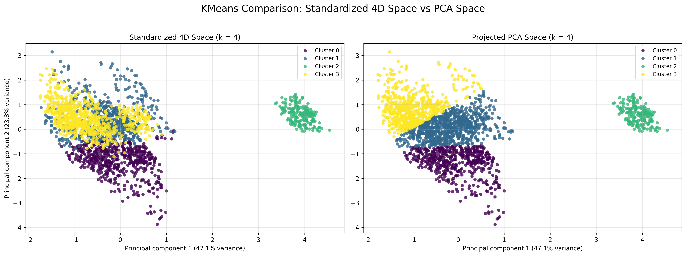

# Crop Recommendation Dataset Analysis

This repository contains a small analysis pipeline for the Kaggle crop recommendation dataset. The project focuses on:

- downloading the raw dataset,
- creating a cleaned copy for reporting,
- exploring correlations,
- running PCA on the four soil features `N`, `P`, `K`, and `ph`,
- running K-means clustering on the same four features.

## Dataset

The source dataset is the Kaggle **Crop Recommendation Dataset** by `atharvaingle`.

Main columns in the raw file:

- `N`
- `P`
- `K`
- `temperature`
- `humidity`
- `ph`
- `rainfall`
- `label`

The file used by the analysis scripts is `data/crops.csv`.

## Project Files

- `download_kaggle_dataset.py`: downloads the Kaggle dataset and saves it as `data/crops.csv`.
- `preprocess_crops_clean.py`: removes missing rows and z-score outliers, then saves `data/crops_cleaned.csv` and a cleaning summary.
- `plot_correlation_matrix.py`: computes and plots the correlation matrix from the raw dataset.
- `pca_analysis.py`: runs PCA using only `N`, `P`, `K`, and `ph`.
- `kmeans.py`: runs K-means using only `N`, `P`, `K`, and `ph`, saves diagnostics, cluster outputs, and plots.

## Requirements

Install the main Python dependencies before running the scripts:

```bash
pip install kagglehub[pandas-datasets] pandas numpy matplotlib scikit-learn tqdm
```

You also need Kaggle access configured locally if you want to download the dataset again.

## Suggested Run Order

```bash
python download_kaggle_dataset.py
python preprocess_crops_clean.py
python plot_correlation_matrix.py
python pca_analysis.py
python kmeans.py
```

## Notes About Data Usage

- `preprocess_crops_clean.py` creates a cleaned copy of the dataset for documentation and quality checks.
- The current PCA and K-means scripts use the original raw dataset at `data/crops.csv`.
- `pca_analysis.py` and `kmeans.py` intentionally use only the four soil features `N`, `P`, `K`, and `ph`.

## Main Outputs

### PCA

`pca_analysis.py` saves its outputs to `outputs/pca_analysis`:

- `pca_pc2_vs_pc1.png`
- `pca_pc1_pc2_pc3_3d.png`
- `pca_scores.csv`
- `pca_explained_variance.csv`

With the current configuration, PCA uses four variables and the explained variance is:

- PC1: `0.4710`
- PC2: `0.2383`
- PC3: `0.2265`
- PC4: `0.0642`

The first three principal components explain about `93.58%` of the total variance.

### K-means

`kmeans.py` saves its outputs to `outputs/kmeans`, including:

- `elbow_method.png`
- `silhouette_method.png`
- `kmeans_standardized_k2.png`
- `kmeans_standardized_k4.png`
- `kmeans_standardized_k4_vs_pca_k4.png`
- `kmeans_standardized_k4_vs_standardized_k2.png`
- `cluster_diagnostics.csv`
- `cluster_selection_summary.csv`
- `cluster_centers.csv`
- `cluster_centers_k2.csv`
- `cluster_centers_k4.csv`
- `cluster_sizes.csv`
- `crops_kmeans_clusters.csv`

### Resultant Comparison Plot

The main comparison figure for the K-means discussion is:



This is the resultant plot used to compare two different pipelines:

- Left panel: K-means is fitted in the **standardized original 4D feature space** using `N`, `P`, `K`, and `ph`, and PCA is used only afterward to visualize the result in two dimensions.
- Right panel: K-means is fitted **directly in the 2D PCA-projected space**. This reproduces the Jamshed et al. style implementation, but it is the wrong implementation if the goal is to cluster the original feature space itself.

The left plot is the correct unsupervised K-means pipeline for this project because:

- clustering is performed on the original standardized variables,
- all four selected features contribute directly to the K-means objective,
- PCA is used only as a visualization tool, not as a replacement clustering space.

The right plot is useful only as a critique of Jamshed et al's research. It is not the correct main result because:

- PCA is applied before clustering,
- the optimization is then performed in a reduced 2D projection rather than the original 4D standardized space,
- this changes the clustering problem and can alter the group boundaries.

So the key interpretation is:

- the **left plot** shows the correct project pipeline and should be treated as the main K-means result,
- the **right plot** shows the PCA-first implementation associated with Jamshed et al., which is methodologically weaker for this task and should be discussed as a comparison, not as the primary clustering result.

## Interpreting the K-means Results

### Diagnostic Summary

From `outputs/kmeans/cluster_selection_summary.csv`:

- Elbow method recommends `k = 4`
- Silhouette method recommends `k = 2`
- The current script chooses the silhouette winner, so the final saved labelled dataset uses `k = 2`

This is an important example of why one metric should not be treated as the whole story.

### Why `k = 2` Is Not Meaningful

The `k = 2` solution has the highest silhouette score (`0.5721`), but it is not very useful as an interpretation of the crop dataset.

The reason is simple:

- Cluster `0` has only `200` rows
- Cluster `1` has `2000` rows
- Cluster `0` contains only `apple` and `grapes`
- Cluster `1` contains the other `20` crop labels

So the `k = 2` result is basically:

> `apple + grapes` versus `everything else`

That split is mathematically neat, but not agriculturally meaningful as a general clustering result. It does not reveal a balanced structure across the full dataset, and it collapses most crops into one giant mixed group.

The cluster centers make this clearer:

- Cluster `0`: `N = 21.99`, `P = 133.38`, `K = 200.00`, `ph = 5.98`
- Cluster `1`: `N = 53.41`, `P = 45.36`, `K = 32.96`, `ph = 6.52`

Cluster `0` is being separated mainly because those two crops have much higher `P` and `K` requirements than the rest. That makes the cluster compact and easy for K-means to isolate, which boosts silhouette score. But it does **not** mean the remaining `20` crop labels form one meaningful group.

In practice, this means:

- the `k = 2` solution is statistically convenient,
- but it is not a strong domain interpretation,
- and it should not be presented as the most meaningful agricultural grouping.

### Why `k = 4` Is More Useful to Discuss

The elbow method recommends `k = 4`, and this is usually the better value to discuss in the report.

For `k = 4`, the cluster sizes are much less collapsed:

- `650`
- `763`
- `200`
- `587`

This still keeps the distinctive high-`P`, high-`K` group, but it also separates the other `2000` rows into additional structure instead of forcing them into one large bucket.

So a reasonable interpretation is:

- `k = 2` is a good example of a result that looks strong numerically but is weak substantively,
- `k = 4` is more useful for explanation because it captures more structure in the dataset.

## Recommended Reporting Language

If you need a short report-style explanation, you can use this:

> Although the silhouette score was highest at `k = 2`, this solution was not substantively meaningful. It mainly separated `apple` and `grapes` from all other crops, creating one small cluster of 200 rows and one large cluster of 2000 rows. Because this split hides most of the variation among the remaining crop types, `k = 4` is a more informative interpretation of the dataset.

## Caveats

- K-means is unsupervised, so the clusters are not expected to match the original crop labels perfectly.
- Silhouette score can prefer overly simple splits when one group is very compact and very distinct.
- The current analysis uses only `N`, `P`, `K`, and `ph` for PCA and K-means, not the full set of weather variables.
